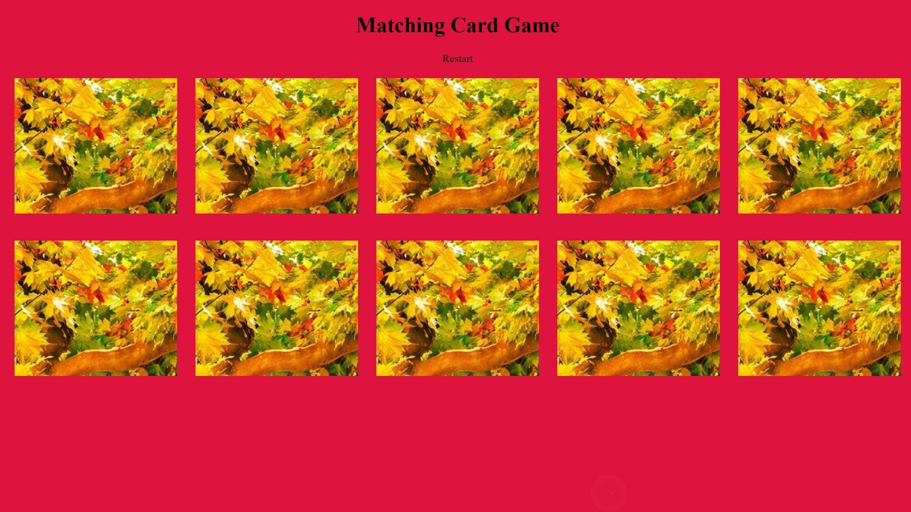

# Matching-Card-Game
This application is a matching card game that restarts after matching all cards.

## How It's Made:

**Tech used:** HTML, CSS, JavaScript

This application is built with having a gameState object that holds the values of each card, with the property is the card index number. Setting a event listener for each card section, when the first card selected is click, we store the index number, follow by clicking on the second card a setTimeOut method runs to allow the user to see the cards. After a set amount of time, the match function runs to see if the cards are the same, if not we set the default image back.

## Optimizations

Include a win match function that tracks score of users points during the game.

## Lessons Learned:

I learned to set key value pairs in an object for control access of information. The sections index number correlates to the property in the gameState object and use that to always reference the section state during the game.
